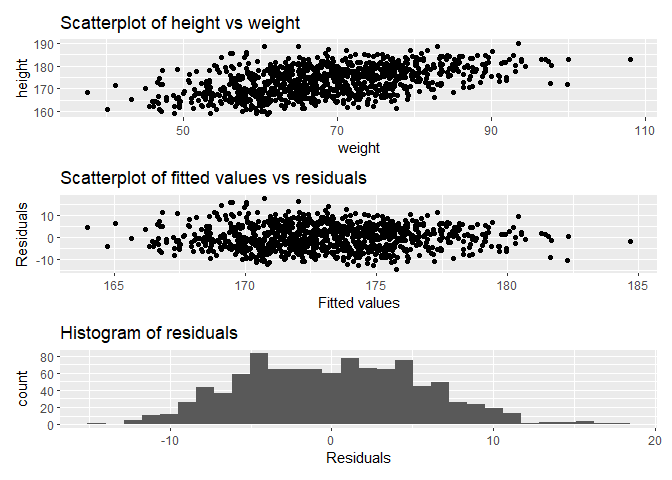
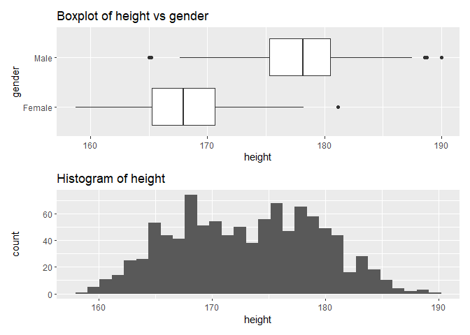
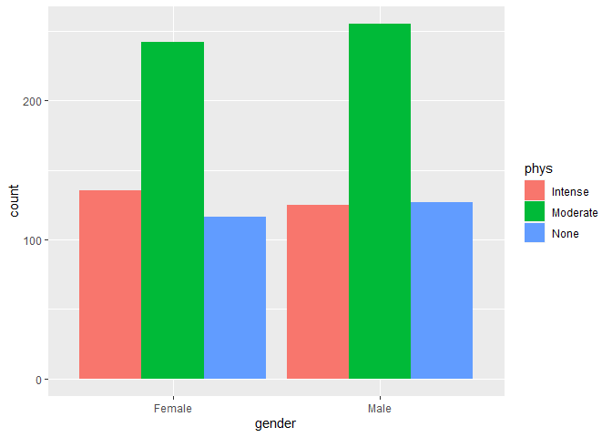

<!-- README.md is generated from README.Rmd. Please edit that file -->

# part2Project

<!-- badges: start -->
<!-- badges: end -->

The goal of part2Project is to perform statistical tests on a data set
of 1000 males and females in context to their height, weight and
physical actvitity

## Installation

You can install the released version of part2Project from Github:

``` r
#remotes::install_github("amugoda_akalanka/Assignment3")
```

## Example

This is a basic example which shows you how to solve a common problem:

``` r
library(part2Project)
## basic example code
#Fitting linear model of height against weight
data(project)
mytest_lm(project)
#> HYPOTHESIS
#> The null hypothesis H0 is beta=0, and the alternative hypothesis H1 is beta different from 0. beta is the true slope parameter as in the model Height = alpha + beta* weight  + epsilon.
#> 
#> ASSUMPTIONS
#> Please check the plots.
#> `stat_bin()` using `bins = 30`. Pick better value with `binwidth`.
```



    #> 
    #> FIT - Linear regression
    #> beta_hat =  0.2932118 
    #> 95% CI = ( 0.2604944 ,  0.3259292 )
    #> t_value =  17.58643 
    #> df =  998 
    #> p_value =  1.627962e-60 
    #> DECISION
    #> 
    #> FIT - Linear regression
    #> beta_hat =  0.2932118 
    #> 95% CI = ( 0.2604944 ,  0.3259292 )
    #> t_value =  17.58643 
    #> df =  998 
    #> p_value =  1.627962e-60 
    #> Reject NULL hypothesis 
    #> 
    #> 
    #> FIT - Linear regression
    #> beta_hat =  0.2932118 
    #> 95% CI = ( 0.2604944 ,  0.3259292 )
    #> t_value =  17.58643 
    #> df =  998 
    #> p_value =  1.627962e-60 
    #> CONCLUSION
    #> There is evidence that the slope (beta) is different than 0. There is a significant linear relationship between height and weight. For each unit-increse in height, weight increases by 0.2932.
    #> $assumptions
    #> `stat_bin()` using `bins = 30`. Pick better value with `binwidth`.


    #> 
    #> $fit
    #> $beta_hat
    #> [1] 0.2932118
    #> 
    #> $p_val
    #> [1] 1.627962e-60
    #> 
    #> $name
    #> [1] "weight"
    #> 
    #> attr(,"class")
    #> [1] "mylm"


    #T Test
    mytest_ttest(project)
    #> HYPOTHESIS
    #> The null hypothesis H0 whereby there in no difference between the mean height of male and female, and the alternative hypothesis H1 whereby there is a differnce in the mean height of male and female.ASSUMPTIONS
    #> Please check the plots.
    #> `stat_bin()` using `bins = 30`. Pick better value with `binwidth`.



    #> 
    #> FIT - T Test
    #> T Stat =  -39.95934 
    #> 95% CI = ( -10.38557 ,  -9.413282 )
    #> p_value =  2.772679e-209 
    #> mean_female =  168.0707 , mean_male =  177.9701 
    #> DECISION
    #> 
    #> FIT - Linear regression
    #> beta_hat =  0.2932118 
    #> 95% CI = ( 0.2604944 ,  0.3259292 )
    #> t_value =  17.58643 
    #> df =  998 
    #> p_value =  1.627962e-60 
    #> Reject NULL hypothesis 
    #> 
    #> 
    #> FIT - T Test
    #> T Stat =  -39.95934 
    #> 95% CI = ( -10.38557 ,  -9.413282 )
    #> p_value =  2.772679e-209 
    #> mean_female =  168.0707 , mean_male =  177.9701 
    #> CONCLUSION
    #> There is a significant difference between height and gender.
    #> $assumptions
    #> `stat_bin()` using `bins = 30`. Pick better value with `binwidth`.


    #> 
    #> $fit
    #> $t_stat
    #>         t 
    #> -39.95934 
    #> 
    #> $p_val
    #> [1] 2.772679e-209
    #> 
    #> attr(,"class")
    #> [1] "mylm"


    #Chi Squared Test
    mytest_chisq(project)
    #> HYPOTHESIS
    #> The null hypothesis H0 is there is no difference between gender and physical activity, and the alternative hypothesis H1 is that there is a relationship between gender and physical activity.ASSUMPTIONS
    #> Please check the plots.
    #> Warning: Ignoring unknown parameters: stat



    #> 
    #> FIT - Chi Squared Test
    #> Chi Squared Test =  1.026799 
    #> p_value =  0.5984576 
    #> df =  2 
    #> DECISION
    #> 
    #> FIT - Linear regression
    #> beta_hat =  0.2932118 
    #> 95% CI = ( 0.2604944 ,  0.3259292 )
    #> t_value =  17.58643 
    #> df =  998 
    #> p_value =  1.627962e-60 
    #> Reject NULL hypothesis 
    #> 
    #> 
    #> FIT - Chi Squared Test
    #> Chi Squared Test =  1.026799 
    #> p_value =  0.5984576 
    #> df =  2 
    #> CONCLUSION
    #> There is no significant relationship between physical activity and gender
    #> $assumptions


    #> 
    #> $fit
    #> $fit$x_stat
    #> X-squared 
    #>  1.026799 
    #> 
    #> $fit$p_val
    #> [1] 0.5984576
